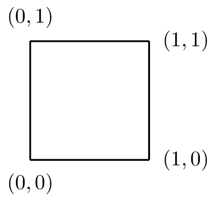
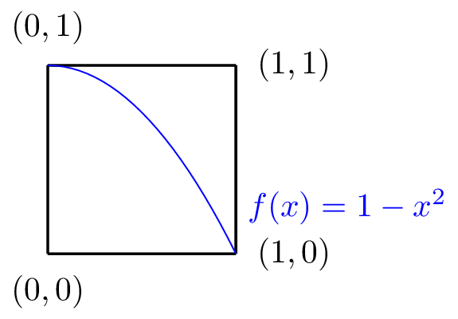

# Computing for Mathematics: Class test

## Instructions

- You have 50 minutes to carry out the following 3 questions;
- You are allowed access to the internet and any books/notes you may have with you. **However, YOU ARE NOT PERMITTED TO COMMUNICATE WITH ANY OTHER STUDENT**. As such you are simply not allowed to log in to an email client, facebook etc... If you are caught using any site that an invigilator suspects you may be able to use to communicate with another student you will be asked to stop working on this class test and reported.
- Write three separate scripts for each question naming them as follows: `ma1003-studentnumber-q1.py' (replacing studentnumber by your actual student number and q1 with q2 or q3 for each of the questions). Submission details are given at the end of this sheet. Start every script with a multiline comment with student number. For example:

~~~{.python}
"""
Class test
123456789
"""
~~~

**10 marks are available for convention, comments and general presentation of code.**

## Q1

Consider the Fibonacci sequence defined by:

$$X_n=\begin{cases}
    1& n=0\text{ or }n=1\\
    X_{n-1} + X_{n-2}&\text{otherwise}
    \end{cases}$$

Define a function `fib(n)` that returns $X_n$ **using a recursive approach**.

Use this function to print to screen $X_n$ for $0\leq n<11$.

(Available marks: 30)

## Q2

The data file [classtestdata.csv](./Data/classtestdata.csv) (**the file can be found at [drvinceknight.github.io/data.html](http://drvinceknight.github.io/Computing_for_mathematics/data.html)**, use the following password: cL3d2a) contains a collections of names. Write a script that:

- Imports the data;
- Prints to screen how many total names are in the data file;
- Prints to screen the mean length of names in the file;
- Prints to screen the number of unique names in the file.

(Available marks: 30)

## Q3

Consider the square on a grid with dimensions as shown:

On this grid, consider the graph of $f(x) = 1 - x ^ 2$.

If we draw points of random coordinates in this square, the probability $P$ of a point landing under the graph would be:

$$P=\frac{\text{Area under the graph}}{\text{Total area of square}}=\frac{\text{Area under the graph}}{1}$$

Importantly, from basic Calculus we know that:

$$\text{Area under the graph}=\int_{0}^{1}1-x^2,dx$$

Use the random library and a class to approximate the value of $\int_{0}^11-x^2,dx$.

(Available marks: 30)

## Submission instructions

Do **both** of the following (if in any doubt ask an invigilator):

- Save your 3 files to the folder called 'MA1003 Class Test' **in the S drive**. You will only be able to do this once!
- Email your file in an attachment to me: knightva@cf.ac.uk. **Use the following as a subject for the email:** MA1003-classtest-yourstudentnumber. For example: 'MA1003-classtest-c123456789'.
